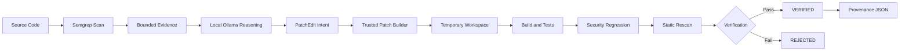

# AIKavach VAYU: Autonomous Cyber Reasoning System

AIKavach VAYU is an intelligent, local Cyber Reasoning System (CRS) built around a simple but powerful continuous security loop:

**Find -> Reason -> Patch -> Verify**

Our vision is to build an autonomous agent that does not just find security flaws, but acts as a tireless security engineer—capable of understanding root causes, proposing safe patches, and proving they work without human intervention.

## The VAYU Vision: A Production-Grade CRS (1-Month Roadmap)

While VAYU is currently in its MVP stage, the ambitious roadmap for the next 30 days will transform it into a production-grade, enterprise-ready security product. Our goal is to achieve true autonomous remediation for complex codebases. 

Here is what VAYU will become after the next month of hard work:

### 1. Advanced Vulnerability Knowledge Graphs
VAYU will move beyond localized pattern matching (Semgrep) to construct comprehensive knowledge graphs of your codebase. It will understand data flow, taint propagation, and complex execution paths across multiple microservices to catch logic flaws that traditional SAST tools miss.

### 2. Deep Autonomous Red-Teaming & Fuzzing
Instead of just static regression checks, VAYU will automatically generate targeted exploits and coverage-guided fuzzers (using libFuzzer/AFL++) for the vulnerabilities it finds. It will prove the vulnerability exists dynamically, and then prove the patch eradicates it.

### 3. Multi-Model and Cloud-Native Orchestration
While local models (Ollama) ensure privacy, VAYU will scale out reasoning to ensembles of larger models (GPT-4o, Claude 3.5 Sonnet, Gemini 1.5 Pro) for highly complex patching scenarios, orchestrated via Kubernetes to handle massive enterprise mono-repos.

### 4. CI/CD Seamless Integration
VAYU will integrate directly into GitHub Actions, GitLab CI, and Jenkins. It will act as an automated reviewer on PRs—leaving comments, suggesting fixes, and even committing verified patches directly to feature branches before bad code ever reaches the main branch.

### 5. Multi-Language Mastery
Expanding beyond Python, VAYU will support full reasoning and patching for Go, Rust, Java, C/C++, and JavaScript/TypeScript, with language-specific AST manipulation and build-system awareness.

### 6. Formal Verification and Provenance
Every patch generated by VAYU will include cryptographically signed provenance (SLSA) and formal verification proofs where applicable, guaranteeing that no malicious code was introduced during the autonomous patching phase.

---

## What VAYU is Today (The MVP)

Today, VAYU provides a robust proof-of-concept that local LLMs can safely remediate code when constrained by a rigid verification pipeline. 

The current MVP scans a repository for known vulnerability patterns, uses a local Ollama model to reason about the finding, generates a constrained edit, builds the patch in trusted code, and verifies the result in a temporary workspace.

**Crucially, the AI model does not get the final say.** A patch is accepted only if formal verification passes.

### Current Capabilities:
- Semgrep-based static analysis for vulnerability discovery.
- Local Ollama reasoning (e.g., `qwen2.5-coder:3b`) for isolated, private analysis.
- Bounded evidence generation passed to the model to prevent hallucination.
- Minimal `PatchEdit` intent generation.
- Deterministic unified-diff construction outside the LLM boundary.
- Patch application in an isolated temporary workspace.
- Verification checks including build, functional tests, security regression, and static rescan.
- Fail-closed `VERIFIED` / `REJECTED` decision matrix.
- JSON provenance record with repository and patch SHA-256 hashes.

The original repository is **never** modified during verification.

---

## Architecture



The LLM is used strictly for reasoning and constrained edit intent. Patch construction and final approval remain entirely outside the model boundary, ensuring deterministic safety.

---

## Setup

Requires Python 3.11 or newer.

```bash
python -m pip install -r requirements.txt
python -m pytest -q
```

For the local model, run Ollama and set your environment variables:

```text
AIKAVACH_LLM_PROVIDER=ollama
AIKAVACH_OLLAMA_URL=http://127.0.0.1:11434
AIKAVACH_OLLAMA_MODEL=qwen2.5-coder:3b
AIKAVACH_OLLAMA_TIMEOUT=180
```

---

## Demo

Run the command-injection sample to see VAYU in action:

```bash
python -m crs.demo samples/vulnerable/command_injection
```

A successful run goes through all four stages (Find -> Reason -> Patch -> Verify) and ends with:

```text
FINAL DECISION : VERIFIED
ORIGINAL REPOSITORY MODIFIED : NO
```

It also writes the latest audit record to:

```text
artifacts/latest_run.json
```

---

## Verification Logic

The final decision is based on the verification harness, not the model's confidence. The current checks are strictly enforced:

1. **Build:** Does the code still compile/interpret without syntax errors?
2. **Tests:** Do all existing functional tests pass? (Zero functional regression)
3. **Security regression:** Does the specific exploit/test for the vulnerability fail now?
4. **Static rescan:** Does the SAST tool confirm the vulnerability signature is gone?

If verification cannot establish that the candidate patch is completely safe, the run is immediately rejected.

---

## Project Status

The core MVP is working end-to-end, and the test suite currently contains 122 passing tests. We are rapidly iterating towards the 1-month production-grade vision. Join us in building the future of autonomous cybersecurity.
